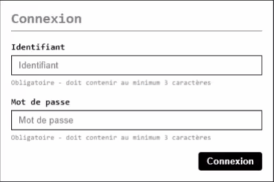

# oLogin : Front

Il est temps de commencer à intéragir avec nos utilisateurs :tada:

On commence doucement avec un formulaire de connexion. Voici le résultat visé :

## Objectifs

1. Mettre en place une validation des champs
    - Chaque champ doit contenir au moins 3 caractères pour être valide
    - Lorsque l'on change de champ, une classe doit être appliquée sur le champ (valide : bordure verte, invalide : bordure rouge)

2. À la soumission du formulaire
    - Chaque champ doit être validé
    - Si il y a des erreurs :
      - on empêche la soumission
      - on les affiche dans le formulaire
    - Si aucune erreur, on soumet le formulaire normalement

## Aides / Infos / Rappels

- Stocker plusieurs erreurs pourrait passer par un tableau
- Écouter le changement de champ pourrait passer par [**mdn** blur](https://developer.mozilla.org/en-US/docs/Web/Events/blur)
- Pour empêcher la soumission d'un formulaire, [**mdn** preventDefault](https://developer.mozilla.org/en-US/docs/Web/API/Event/preventDefault) est nécessaire
- Pour sélectionner de multiples éléments du DOM, [**mdn** getElementsByClassName](https://developer.mozilla.org/en-US/docs/Web/API/Document/getElementsByClassName) ou [**mdn** querySelectorAll](https://developer.mozilla.org/en-US/docs/Web/API/Document/querySelectorAll) sont parfait
- [**mdn** innerHTML](https://developer.mozilla.org/en-US/docs/Web/API/Element/innerHTML) est pensé pour insérer du contenu HTML dans le DOM

Plan (si nécessaire)

#### #1 Validation lors de la saisie

- écouter l'event "blur" sur tous les inputs
- dans le handler de cet event,
  - récupérer l'élément input sur lequel l'event a eu lieu
  - si l'input est vide, ajouter une classe à l'input qui l'entoure de rouge
- sinon, ajouter une classe à l'input qui l'entoure de vert

#### #2 Validation lors de la soumission

- écouter l'event "submit" sur le formulaire
- dans le handler de cet event,
  - vérifier que chaque input est rempli
  - si c'est le cas, ne rien faire, laisser le formulaire être soumis normalement (et donc le navigateur envoie les données sur une autre URL)
  - sinon, empêcher la soumission et afficher la ou les erreurs dans la div#errors

## BONUS

Tu veux dire que tu as fini toutes les vérifications en JS ?

Ok, alors tu peux t'attaquer [aux bonus](bonus.md) (et oui, il y en a plusieurs en plus :tada:)

