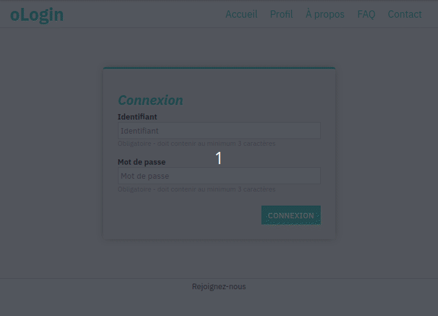

# Bonus

## ... beauté :lipstick:

Modifier/revoir le code CSS afin que la page ressemble à cette preview :

### Aides

- `display: flex` est un allié précieux ([**mdn** flex](https://developer.mozilla.org/en-US/docs/Web/CSS/flex))
- [**mdn** box-shadow](https://developer.mozilla.org/en-US/docs/Web/CSS/box-shadow) peut aider pour la présentation du formulaire
- La gestion des couleurs pour les champs peut passer par l'usage d'une classe CSS

### Fonts

IBM Plex Sans, avec les variantes :

- normal
- bold
- bold italic

### Couleurs

- Couleur de fond de page : blanc : #fff
- Couleur de fond de zone de contenu : gris très léger : #fafafa
- Couleur de fond du formulaire : gris léger : #f1f1f1
- Couleur des bordures : gris : #ccc
- Vert : #00d1b2
- Rouge/Rose : #ff3860
- Ombre portée : sur 20px => gris : #aaa
- Contenus : noir : #000
- Notes sous les champs : gris : #999

## ... qui pique :spades:

Plutôt que de gérer les classes CSS ajoutées au DOM par `className`, vous pourriez utiliser `classList`.

- [**mdn** classList](https://developer.mozilla.org/en-US/docs/Web/API/Element/classList)

## ... de la mort :skull:

Au lieu d'utiliser `innerHTML` ou `textContent` pour ajouter du contenu dans le DOM, vous pourriez créer un élément du DOM de toute pièce (par la programmation) - par exemple créer des `
 ...` directement dans le JS :scream:

- [**mdn** createElement](https://developer.mozilla.org/en-US/docs/Web/API/Document/createElement)
- [**mdn** appendChild](https://developer.mozilla.org/en-US/docs/Web/API/Node/appendChild)
